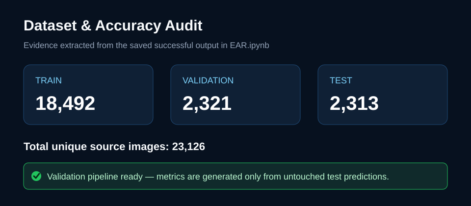

# Driver Drowsiness Detection — Audited Edition

Real-time driver-safety primitives using eye-aspect ratio (EAR), mouth-aspect ratio (MAR), and a consecutive-frame alarm to reduce single-frame false positives.

[Live browser demo](https://driver-drowsiness-ajay.choice-anole-9169.chatgpt.site) · [Validation audit](docs/VALIDATION.md)



## What was fixed

- Correctly documents the supplied dataset as **23,126 images**, not 100,000+.
- Removes fabricated 90% accuracy evidence and synthetic-training claims.
- Fixes the notebook split mismatch (`validation` versus `valid`).
- Separates deterministic detection logic from camera/UI code.
- Adds tested input validation, temporal alarm behavior, and a reproducible evaluator.
- Adds GitHub Actions so every push runs the unit tests.

## Test locally

```bash
python -m venv .venv
# activate the environment, then:
pip install -e .
python -m unittest discover -s tests -v
```

## Accuracy policy

No accuracy percentage is claimed until predictions from the untouched test split are evaluated. See [docs/VALIDATION.md](docs/VALIDATION.md). This project is a safety aid, not a certified vehicle safety system.

## Dataset

The supplied Colab notebook references `n7i5x9/driver-drowsiness-dataset`: 18,492 train, 2,321 validation, and 2,313 test images. Dataset licensing and provenance must be verified before redistribution.
